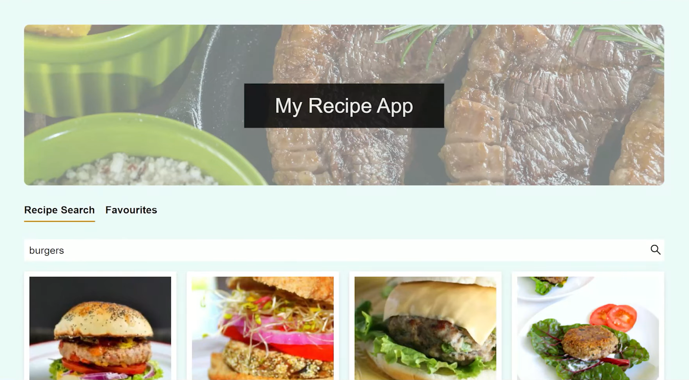

<h1 align="center">Recipe App</h1>  

  Recipe app that can search, view, add, and manage favorite recipes. I have used React for the front end, Node.js with Prisma for the back end, and PostgreSQL database.

---

  Node.js | React.js | PostgreSQL 

---

### Screenshots:

